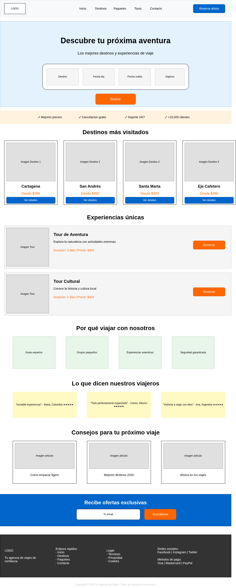

# Viajes Co — Landing Page

Página web de una agencia de viajes donde los usuarios pueden explorar destinos turísticos, tours y paseos, y buscar su próximo viaje.

---

## Layout del Proyecto

A continuación se muestra el diseño base (wireframe / layout), utilizado como referencia para la maquetación de la página:

Nota: profesor usted dijo que usaramos (Excalidraw), pero este fin de semana tenia un problema con el internet, por lo tanto desidí usar (draw.io) que es una plataforma que tengo descargada en mi linux, y con ella es que hago todos los mockup y diagramas de mis aplicaciones. 

---

## Maquetación: Flexbox & CSS Grid

En el desarrollo de la interfaz se aplicó la regla fundamental de CSS moderno:
- **Flexbox** para componentes **unidimensionales (1D)** (en fila o columna), distribución de elementos con anchos dinámicos o alineación de contenido interno.
- **CSS Grid** para estructuras **bidimensionales (2D)** y sistemas de cuadrículas rígidas donde se definen columnas y filas proporcionales.

A continuación se detalla la justificación técnica de cada sección:

---

### 1. Encabezado (`.header` y `.nav`) — **Flexbox**
* **Propiedad:** `display: flex;`
* **Por qué se eligió:**
  * **Header principal (`.header`):** Requiere alinear horizontalmente 3 elementos dispares (logo a la izquierda, menú de navegación y botón de reserva). Con `justify-content: space-between` y `align-items: center` se logra una separación automática hacia los extremos y un centrado vertical impecable sin cálculos fijos.
  * **Barra de navegación (`.nav`):** Es una lista lineal de enlaces horizontales. Con Flexbox y `gap: 30px` se gestiona el espaciado uniforme entre ítems de forma limpia y moderna.

---

### 2. Buscador del Hero (`.search-box` y `.search-field`) — **Flexbox**
* **Propiedad:** `display: flex;`
* **Por qué se eligió:**
  * **Caja del buscador (`.search-box`):** Los campos del formulario y el botón de búsqueda forman una barra de herramientas horizontal en una sola dimensión. Con `align-items: flex-end`, el botón queda perfectamente alineado a la base de los inputs, compensando la altura extra de las etiquetas (`<label>`).
  * **Campos individuales (`.search-field`):** Utilizan `flex: 1` para repartirse el espacio horizontal equitativamente, y `flex-direction: column` para apilar verticalmente la etiqueta sobre el input.

---

### 3. Barra de Confianza (`.trust-bar`) — **Flexbox**
* **Propiedad:** `display: flex;`
* **Por qué se eligió:**
  * Se trata de una fila simple de características de valor (precios, cancelación, soporte, clientes).
  * Flexbox permite centrar todo el conjunto horizontalmente con `justify-content: center` y definir un espacio consistente entre cada texto con `gap: 60px`.

---

### 4. Destinos más visitados (`.grid-destinos`) — **CSS Grid**
* **Propiedad:** `display: grid; grid-template-columns: repeat(4, 1fr);`
* **Por qué se eligió:**
  * Es una cuadrícula estructurada de 4 columnas iguales.
  * Con `repeat(4, 1fr)` y `gap: 25px`, Grid calcula y garantiza que todas las tarjetas tengan exactamente el mismo ancho y altura uniforme, asegurando una alineación geométrica perfecta tanto en filas como en columnas sin depender del tamaño del contenido interior.

---

### 5. Experiencias únicas / Tours (`.tour`) — **Flexbox**
* **Propiedad:** `display: flex;`
* **Por qué se eligió:**
  * Cada tarjeta de tour se compone de 3 partes horizontales con necesidades distintas:
    1. Una imagen con ancho fijo (`.tour-img { flex-shrink: 0; }`).
    2. Un bloque informativo que debe expandirse y tomar todo el espacio sobrante (`.tour-info { flex: 1; }`).
    3. Un botón de acción alineado al lateral.
  * Flexbox es el modelo ideal para distribuir elementos con diferente comportamiento de crecimiento en un único eje y alinearlos verticalmente al centro con `align-items: center`.

---

### 6. Por qué viajar con nosotros (`.grid-why`) — **CSS Grid**
* **Propiedad:** `display: grid; grid-template-columns: repeat(4, 1fr);`
* **Por qué se eligió:**
  * Se diseñó como una matriz de 4 cajas de beneficios.
  * CSS Grid permite que cada celda mida exactamente la cuarta parte del contenedor disponible (`1fr`) y que todas las cajas mantengan dimensiones simétricas y ordenadas sin necesidad de márgenes flotantes.

---

### 7. Testimonios (`.grid-testimonios`) — **CSS Grid**
* **Propiedad:** `display: grid; grid-template-columns: repeat(3, 1fr);`
* **Por qué se eligió:**
  * Requiere una división equitativa en 3 columnas (`repeat(3, 1fr)`).
  * Grid garantiza que las 3 tarjetas de testimonios compartan exactamente el mismo ancho y se alineen en una fila balanceada con separación homogénea (`gap: 25px`).

---

### 8. Newsletter (`.newsletter-form`) — **Flexbox**
* **Propiedad:** `display: flex;`
* **Por qué se eligió:**
  * Es una estructura unidimensional corta (campo de correo + botón de suscripción).
  * Flexbox simplifica centrar ambos elementos en la sección (`justify-content: center`) y mantenerlos en una sola línea fluida con una separación adecuada (`gap: 15px`).

---

### 9. Footer (`.footer`) — **Flexbox**
* **Propiedad:** `display: flex; flex-wrap: wrap;`
* **Por qué se eligió:**
  * El pie de página contiene múltiples columnas de navegación que crecen de manera fluida (`.footer-col { flex: 1; }`).
  * Con `flex-wrap: wrap`, el bloque de derechos de autor (`.copyright { width: 100%; }`) salta automáticamente a una nueva fila completa al final, logrando una distribución limpia y adaptable.

---

## Cómo visualizar el proyecto

1. Asegúrate de tener los archivos en la misma carpeta (`index.html`, `styles.css` e imágenes).
2. Abre [`index.html`] en tu navegador web preferido.
